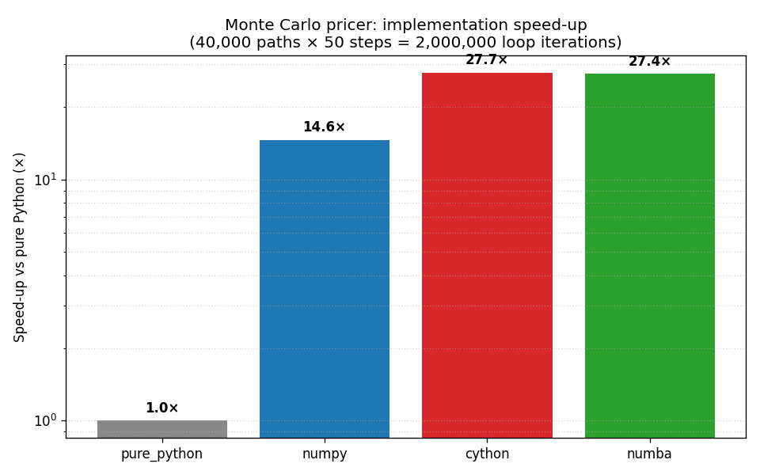
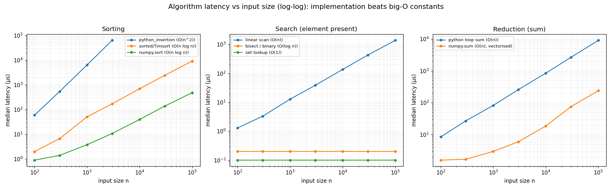

# Latency & Cythonization — Quant Developer (Advanced)

*Quant Developer · Advanced · Flask + Plotly*

A hands-on project on **performance engineering for quants**. It teaches you to:

1. **Measure latency rigorously** — compare algorithm implementations, relate
   wall-clock time to big-O, and see how latency scales with input size.
2. **Cythonize a hot numerical loop** — take a pure-Python Monte Carlo option
   pricer and compile its inner loop to C, then compare it honestly against
   numpy-vectorised and numba-JIT versions.

The centerpiece is a before/after benchmark of the **same** Monte Carlo European
option pricer written four ways — available both as CLI scripts and as an
interactive **Latency Lab** dashboard (same visual language as the Pricing Library).

---

## TL;DR — what we measured on this machine

Environment: Windows, Python 3.14, numpy 2.4, MSVC Build Tools; **the Cython
extension compiled successfully here**, and numba was installed.

Monte Carlo European call, **40,000 paths × 50 steps = 2,000,000** inner-loop
iterations, all four implementations pricing the *identical* random paths:

| implementation | median time | speed-up vs pure Python |
| --- | ---: | ---: |
| pure Python (explicit loops) | ~141 ms | 1.0× (baseline) |
| numpy (vectorised)           | ~9.7 ms | **~15×** |
| **Cython (typed, compiled)** | ~5.1 ms | **~28×** |
| numba (`@njit`)              | ~5.2 ms | ~27× |

All four agree on the price to ~1e-14 (they share the same paths), and the
Monte Carlo estimate (10.596) sits within finite-sample error of the closed-form
Black–Scholes value (10.451).



Algorithm-latency benchmark headlines:

* At n=1,000, built-in Timsort (`sorted`) is **~127× faster** than a pure-Python
  O(n²) insertion sort.
* At n=100,000, a `set` lookup (O(1)) is **thousands of times faster** than a
  linear scan (O(n)).
* At n=1,000,000, `numpy.sum` is **~38× faster** than a Python `for`-loop sum —
  *same* O(n), better constants.



> Your exact numbers will differ by hardware, OS, and library versions — the
> *ratios* and *scaling shapes* are the lesson, not the absolute milliseconds.

---

## Files

| File | What it is |
| --- | --- |
| `app.py` | Flask **Latency Lab** dashboard (port **5005**): MC speed-up + algorithm latency tabs, Plotly + MathJax. |
| `latency_benchmark.py` | Benchmarks sorting / search / reduction across input sizes; prints tables and saves `latency_results.png` (log-log). |
| `mc_python.py` | Pure-Python Monte Carlo pricer — the intentionally slow baseline. |
| `mc_numpy.py` | Numpy-vectorised pricer. |
| `mc_cython.pyx` | Cython pricer (typed memoryviews, `boundscheck(False)`, C `exp`/`sqrt`). |
| `setup.py` | Builds the Cython extension (`python setup.py build_ext --inplace`). |
| `mc_numba.py` | Optional numba `@njit` pricer (import-guarded). |
| `benchmark.py` | **Centerpiece**: runs every *available* implementation on the same seed, verifies agreement, prints a speed-up table, saves `mc_speedup.png`. Never crashes if Cython isn't built. |
| `requirements.txt` | Dependencies (`flask`, `plotly` for the dashboard). |

---

## Quick start — interactive dashboard

```powershell
pip install -r requirements.txt
# (optional) enable Cython + numba for the full four-way comparison
pip install numba
python setup.py build_ext --inplace

python app.py
# open http://127.0.0.1:5005
```

Two tabs:

1. **Monte Carlo Speed-up** — shared-path agreement check, median latency, and
   speed-up bars for pure Python / numpy / Cython / numba (whichever are available).
2. **Algorithm Latency** — log-log latency vs \(n\) for sorting, search, and
   reduction, with live takeaway multipliers.

## CLI benchmarks (headless)

```powershell
# 1. Install dependencies
pip install -r requirements.txt
# (optional) enable the numba implementation
pip install numba

# 2. Build the Cython extension (needs a C compiler; see below)
python setup.py build_ext --inplace

# 3. Run the benchmarks
python benchmark.py            # Monte Carlo pricer comparison  -> mc_speedup.png
python latency_benchmark.py    # algorithm latency vs size      -> latency_results.png
```

`benchmark.py` accepts flags:

```powershell
python benchmark.py --paths 40000 --steps 50 --repeats 5 --seed 12345
```

Both scripts use matplotlib's non-interactive **Agg** backend, so they run
headlessly (CI, SSH, no display) and just write PNGs.

### If you don't have a C compiler

`benchmark.py` is designed to **degrade gracefully**. If `mc_cython` isn't built
it prints a note with build instructions and runs the remaining implementations
(pure Python + numpy, plus numba if installed). It will not crash.

To get a compiler:

* **Windows** — install *Build Tools for Visual Studio* (the "Desktop
  development with C++" workload).
* **Linux** — `sudo apt install build-essential`.
* **macOS** — `xcode-select --install`.

---

## Concepts

### Latency vs throughput

* **Latency** = time for *one* operation to complete (how long a single option
  price takes). This is what matters for a request/response quote, a hot path in
  a strategy, or an interactive tool.
* **Throughput** = operations *per unit time* (how many prices per second across
  a batch). This is what matters for overnight risk, large calibrations, or grid
  jobs.

They are related but not identical: vectorised/batched code often has *higher
throughput* but *worse per-item latency setup cost*, while a JIT has great
throughput once warm but pays a one-off compile latency on the first call.

### How to benchmark correctly

Naive timing lies. This project follows the practices that make numbers
trustworthy:

1. **Warm up first.** The first call pays one-off costs: numba JIT compilation,
   CPU cache/branch-predictor warming, page faults on first memory touch. We run
   untimed warm-up calls and *exclude* them (`bench(..., warmups=1)`).
2. **Repeat and take the median.** A single sample is noise. We run several
   repetitions and report the **median** (robust to occasional OS-scheduling
   spikes) plus the spread (stdev / min / max). The mean is skewed by outliers;
   the median is not.
3. **Use a monotonic high-resolution clock.** `time.perf_counter` (and `timeit`,
   which wraps it and disables the GC) — never `time.time`.
4. **Hold everything else equal.** Same input, same seed, same machine, back to
   back. In `benchmark.py` all implementations price the *identical* random
   paths, so any speed difference is purely the compute, not the workload.
5. **Beware of pitfalls:** dead-code elimination (make sure the result is used),
   caching effects, the GC firing mid-measurement, and comparing cold vs warm
   code. Fixed here by consuming results, disabling GC (via `timeit`), and
   warming up.

### Big-O vs real constants

Big-O tells you how cost *scales*; it says nothing about the *constant factor*.
The latency benchmark makes this vivid:

* **Same big-O, very different constants.** `numpy.sum` and a Python loop are
  both O(n), yet numpy is ~38× faster because the per-element work happens in
  compiled C over contiguous memory instead of the Python interpreter.
* **Different big-O eventually dominates.** An O(n²) insertion sort is fine at
  n=100 but explodes by n=3,000; O(n log n) Timsort and O(n log n) `numpy.sort`
  stay manageable. On the log-log plot, O(1)/O(log n) lookups are ~flat lines,
  O(n) has slope ≈ 1, and O(n²) is the steep one.

Lesson for quant devs: **pick the right algorithm first (big-O), then squeeze the
constant (implementation/vectorisation/compilation).** Optimising constants on a
quadratic algorithm is a losing game at scale.

### What Cython actually does

Pure Python is slow in tight numeric loops because every operation goes through
the interpreter: objects are boxed, types are checked at runtime, and each
`x[i]` and `math.exp` is a dynamic dispatch. Cython removes that overhead:

* **Static typing** (`cdef double`, `Py_ssize_t`) — variables become native C
  types, so arithmetic is raw machine instructions, not Python-object calls.
* **Typed memoryviews** (`double[:, ::1]`) — array elements are accessed as C
  doubles with pointer arithmetic; no per-element Python boxing.
* **Compiling to C** — the `.pyx` is translated to C and compiled to a native
  extension module, eliminating the interpreter from the hot loop entirely.
* **Releasing safety checks** — `boundscheck(False)` and `wraparound(False)`
  drop per-index bounds/negative-index checks (safe here because we control the
  indices), and `cdivision(True)` uses C division semantics.
* **C math** — `from libc.math cimport exp, sqrt` calls the C library directly
  instead of Python's `math` module.

The net effect: the inner loop becomes essentially the same machine code a
hand-written C program would produce. That's why it lands around ~28× here,
neck-and-neck with numba (which achieves the same thing via LLVM JIT at runtime,
with no separate build step).

**Why is numpy "only" ~15×?** It vectorises beautifully but must materialise
whole intermediate arrays (the full `(paths × steps)` increment matrix, its
cumulative/terminal reduction, etc.), which is memory-bandwidth bound. Cython
and numba stream each path in registers with O(1) extra memory, so they win on
both time *and* memory. numpy is still the pragmatic default: 15× for zero build
complexity is an excellent trade.

---

## Reproducing the verification

`benchmark.py` prints an **agreement check**: because every implementation is
handed the same pre-generated normal shocks `Z`, the only differences are
floating-point summation order, so they match to ~1e-14. It also prints the
closed-form Black–Scholes price as an independent sanity check — the Monte Carlo
estimate should land within a few standard errors of it.

---

## Notes / honest caveats

* We **share the random numbers** across implementations. This is deliberate: it
  makes the comparison a pure test of the *pricing loop* and gives exact
  agreement for verification. It excludes RNG generation time (numpy's RNG is
  already C-fast and identical for everyone).
* Numba's first call compiles; we warm it up before timing so the reported
  number is steady-state, not the compile.
* Absolute timings are hardware/OS/version dependent. Re-run on your box; the
  script prints everything it measured.
